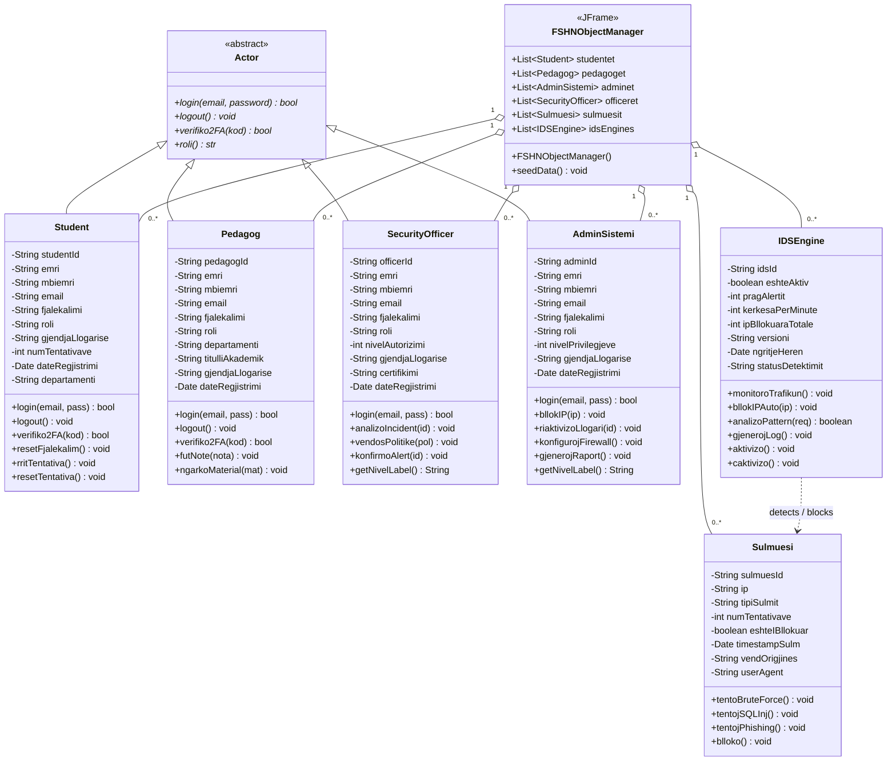

# FSHN — Sistema e Sigurisë Universitare
## Diagrama e Klasave UML

### Legjenda e Marrëdhënieve

| Simboli | Lloji | Përshkrimi |
|---------|-------|------------|
| `<\|--` | Trashëgimi (Generalizim) | Student, Pedagog, SecurityOfficer dhe AdminSistemi zgjerojnë klasën abstrakte Actor |
| `o--`   | Agregim (1 me shumë) | FSHNObjectManager mban lista të objekteve të çdo klase |
| `..>`   | Varësi (Dependency) | IDSEngine zbule dhe bllokon objekte Sulmuesi |

### Klasat dhe Rolet e Tyre

| Klasa | Roli |
|-------|------|
| `Actor` | Klasë abstrakte bazë për të gjithë aktorët me llogari (Python) |
| `Student` | Studentët e universitetit; login me 2FA, kontrolli i tentativave |
| `Pedagog` | Pedagogët; fu​t nota, ngarkon materiale |
| `SecurityOfficer` | Oficeri i sigurisë; analizon incidente, vendos politika |
| `AdminSistemi` | Admini i sistemit; bllokon IP, konfiguron firewall |
| `Sulmuesi` | Aktori kërcënues i jashtëm; BruteForce / SQLInjection / Phishing |
| `IDSEngine` | Sistemi i zbulimit të ndërhyrjeve (IDS); monitoron trafik, bllokon IP automatikisht |
| `FSHNObjectManager` | Menaxheri GUI (Swing/JFrame); agregon të gjitha objektet e sistemit |
